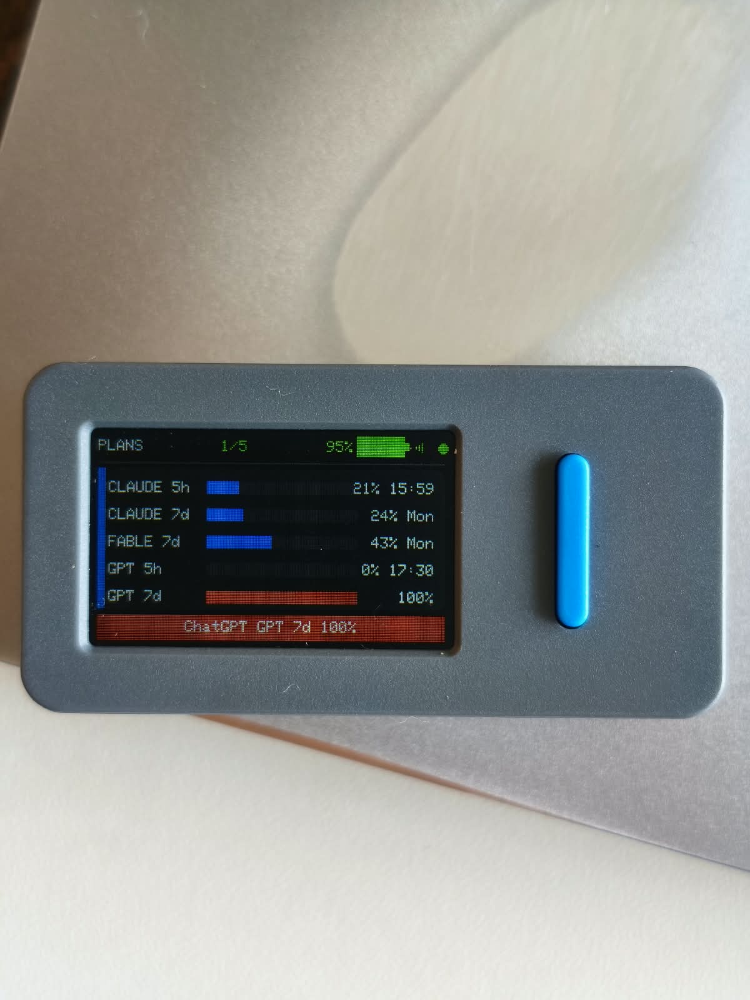
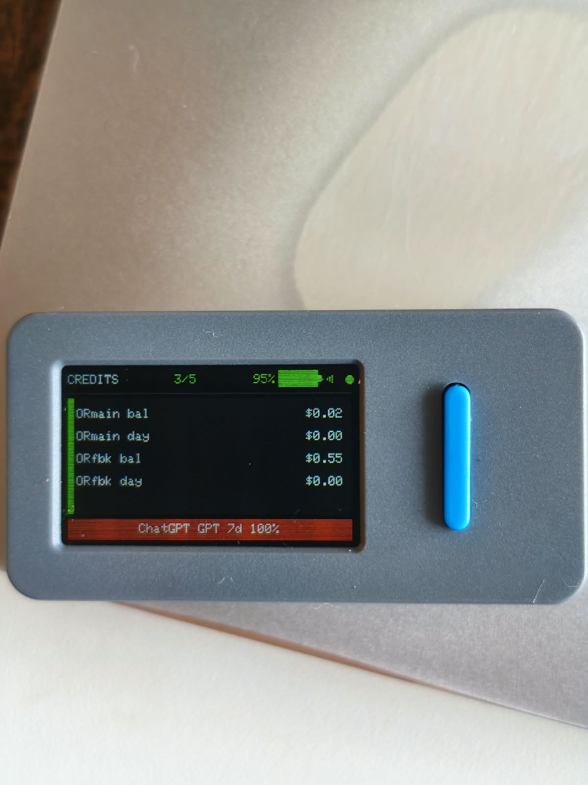

# ai-usage — AI usage on a tiny screen

Your Claude Code and Codex quotas on an M5StickS3, and in a local dashboard.
A small Go daemon runs on your Mac, reads the usage numbers, and the stick
mirrors them.

 

<p align="center">
  
  &nbsp;
  
</p>

<p align="center"><em>Left: subscription quotas and when each resets. Right: pay-as-you-go
balances. BtnA cycles pages; the bar across the bottom is an alert.</em></p>

## Install (macOS)

**Have an AI agent do it.** Paste [this prompt](docs/AGENT_PROMPT.md) into Claude
Code, Codex CLI, Cursor — anything that can run shell commands. It installs the
daemon, sets up the stick, walks you through the one moment you are needed, and
checks its own work instead of trusting what a command printed.

Or do it yourself:

```sh
curl -fsSL https://raw.githubusercontent.com/fcavalcantirj/sticks3-ai-usage/main/install.sh | bash
```

Then open <http://127.0.0.1:8765>. Nothing to configure, no key to paste.

It downloads the latest release, checks it against the published `SHA256SUMS`,
and installs a LaunchAgent that starts at login. [Read the script first][inst]
if you would rather not pipe something to a shell unread — it is short, and so
is the installer it unpacks.

[inst]: install.sh

<details>
<summary>Build from source</summary>

Needs Go 1.26+. No `.env` and no configuration:

```sh
git clone https://github.com/fcavalcantirj/sticks3-ai-usage
cd sticks3-ai-usage
make install
```

It builds, generates a device token, writes a LaunchAgent for your paths, and
starts. A `.env` is optional and only for development — if one exists it wins,
and it is how provider API keys get in.

</details>

<details>
<summary>Prefer to download it by hand?</summary>

Grab the tarball from [Releases](https://github.com/fcavalcantirj/sticks3-ai-usage/releases), then:

```sh
tar -xzf ai-usage-*-darwin-universal.tar.gz
cd ai-usage-*-darwin-universal
./install.sh
```

**A browser download trips Gatekeeper.** The binary is not notarized — that
needs a paid Apple Developer Program certificate this project does not have —
so macOS marks it quarantined and refuses to run it. The installer clears that
flag on a file you chose to download. The one-liner above avoids this entirely:
`curl` never sets the quarantine attribute. Or build from source with
`make build`.

</details>

**Uninstall:**

```sh
launchctl bootout gui/$(id -u)/com.fcavalcanti.ai-usage
rm -f ~/Library/LaunchAgents/com.fcavalcanti.ai-usage.plist ~/.local/bin/ai-usage
```

## Where the numbers come from

`ai-usage` does not ask you for a password and cannot log in on your behalf. It
**reads credentials that other tools already store**:

| Provider | Source | You need |
|---|---|---|
| Claude | macOS Keychain item `Claude Code-credentials` | [Claude Code](https://claude.com/claude-code) installed and logged in |
| ChatGPT / Codex | `~/.codex/auth.json` | Codex CLI installed and logged in |
| OpenRouter, Groq | API keys you add in Settings | an account (optional) |
| OpenCode Go | API key you add in Settings | an [OpenCode Go](https://opencode.ai) subscription (optional) |

A provider you do not use simply says so. It never refreshes, rotates or copies
a token — when one expires the page shows a "run claude" badge and nothing else.

## Setting up the stick

Flash the firmware from **M5Burner** (search for `ai-usage`), then:

1. Power the StickS3 on. It shows a setup screen and advertises over Bluetooth.
2. In the dashboard, open **Settings** and click **Look for a device**.
3. Click **Set it up**. If macOS asks for six digits, they are on the stick's
   own screen.

That is the whole setup. The daemon sends the Wi-Fi name, the Wi-Fi password,
its own address, its port and a token it mints for that device — you type
nothing but those six digits.

**No Bluetooth?** After ten minutes the stick raises its own Wi-Fi network
instead. Join `ai-usage-XXXX` from a phone, and a setup page opens by itself.

**The firmware carries no credentials.** Wi-Fi details live only in the stick's
own storage, written during setup — never compiled into the published image.

## What you can change in Settings

Everything below takes effect immediately — no restart, no config file to edit.

| Control | What it does |
|---|---|
| **Provider on/off** | Unchecking one stops polling it and removes it from the stick entirely |
| **API keys** | Stored in the macOS Keychain, never in a file. Adding one starts polling it at once |
| **Alert thresholds** | Two knobs: warn at *n*% of the 5-hour window, and at *n*% of the weekly one. Weekly defaults lower (60 vs 70) because a weekly cap you cannot recover from in an afternoon deserves earlier notice |
| **Provider order** | Drag the order you want. The stick obeys it — the first providers fill its first page |
| **Poll interval** | How often the daemon asks. Minimum 300 s |

The stick groups its pages by kind — subscription plans first, then prepaid
credit, then free tiers — so reordering moves a provider within its group.

## Requirements

- macOS (the daemon reads the macOS Keychain and drives CoreBluetooth)
- An M5StickS3, if you want the screen. The dashboard works without one.

---

# Developer documentation

## Architecture

```
          ┌────────────┐         ┌──────────┐          ┌──────────┐
          │  Claude    │  token  │          │  JSON v1  │          │
          │  Code      │ from KC │  ai-usage  │────────│ snapshot │
          └────────────┘         │  (Go)     │ ETag/304│  state   │
          ┌────────────┐  token  │           │          │          │
          │  Codex     │ from jc │          │          │  file    │
          └────────────┘         └────┬─────┘          └──────────┘
                                      │ HTTP
                                      │   LAN 0.0.0.0:8765
                       ┌──────────────┼──────────────┐
                       │  browser     │  M5StickS3   │
                       │  dashboard   │  (OTA, unit #2)│
                       └──────────────┴──────────────┘
```

## Quick start

```sh
cp .env.example .env          # edit USAGED_DEVICE_TOKEN and provider keys
make install                  # builds, validates .env, installs + starts LaunchAgent
open http://127.0.0.1:8765/   # or LAN: http://<mac-ip>:8765/?token=<your-token>
```

Or run without installing:

```sh
make build && ./bin/ai-usage serve
# LAN clients: http://<mac-ip>:8765/?token=<your-token>
```

## CLI

| Command | Description |
|---|---|
| `ai-usage version` | Print version + commit. |
| `ai-usage serve` | Start the poller (900 s) and HTTP API server. |
| `ai-usage once [--json]` | Single fetch cycle; prints table or JSON. Exit 0 if all ok/stale, 3 if any auth/error/off. |
| `ai-usage once --fixtures DIR` | Offline mode: serve from captured fixtures. |
| `ai-usage once --scenario NAME` | Apply a scenario overlay from `testdata/scenarios/NAME/`. |

## API

| Endpoint | Method | Auth | Description |
|---|---|---|---|
| `/healthz` | GET | none (loopback) | `{ok, seq, rev, checked_at, uptime_sec}`. |
| `/v1/usage` | GET | token (LAN only) | Snapshot JSON v1 with `ETag: "<rev>"`. `If-None-Match` match → `304` (empty body). |
| `/v1/usage.txt` | GET | token (LAN only) | Human table (same as `ai-usage once`). |
| `/v1/refresh` | POST | token (LAN only) | Trigger an immediate poll; `200` if refreshed, `202` if coalescing. |
| `/` `/index.html` | GET | none (loopback) | Embedded dashboard. |

The dashboard polls `/v1/usage` every 60 s with `If-None-Match`; the body is
empty on 304 so mobile data is never re-downloaded.

## Snapshot v1 contract

```json
{"v":1,"seq":1,"rev":"a1b2c3d4","generated_at":1788414949,
 "checked_at":1788414949,"next_sec":900,
 "providers":[
   {"id":"claude","label":"Claude","plan":"max_20x","status":"ok",
    "msg":"","fetched_at":0,
    "rows":[{"k":"5h","label":"CLAUDE 5h","pct":19,"txt":"05:09",
             "tier":"ok","reset_at":1788411000}]}]}
```

`rev` is an 8-hex SHA-256 of the provider/row data. `seq` increments only when
`rev` changes. The firmware stores `rev` in `lastRev` and skips redraw on 304.

## Firmware

```sh
cd firmware
pio run                                   # build
pio run -e m5stack-sticks3 -t upload      # serial flash (unit #2 only)
make fw-ota                               # OTA flash (unit #2 only, MAC-guarded)
pio device monitor                        # serial monitor @ 115200
make fw-test                              # host-unit tests
```

**Unit #2 only.** The device is MAC `14:c1:9f:d4:d5:34`, hostname
`sticks3-usage`. Unit #1 (`ac:27:6e:d2:68:b8`) is off-limits. OTA is
password-protected via `OTA_PASS` in `secrets.h` (never committed).

Serial protocol (one line per event, see `firmware/README.md` for the full table):

```
[BOOT] board=26 psram=8388608 build=abc123 fw=1.0.0
[WAKE] cause=power_on vbus=5282
[NET] state=connected ip=192.168.0.136
[FETCH] code=200 rev=a1b2c3d4 seq=1 ms=310
[RENDER] page=1 lines=5 rev=a1b2c3d4
[HEAP] free=8388608 min=6543210
[SLEEP] reason=battery
```

## Troubleshooting

| Symptom | Fix |
|---|---|
| `auth` badge / 401 from Claude | Run `claude` in a terminal to re-authenticate; the Keychain item `Claude Code-credentials` is read automatically. |
| Keychain prompt denied | Re-run `make install` with Felipe present; click **Always Allow** when the system prompts. |
| `429` from API | Cooldown ~24 h; the scheduler honors `Retry-After` and backs off. |
| Stale badge / `Mac asleep` | Wake the Mac; Wi-Fi sleep pauses polling. |
| OTA upload refused | Check MAC guard in `firmware/scripts/upload_ota.sh`; verify `OTA_PASS` in `secrets.h`. |
