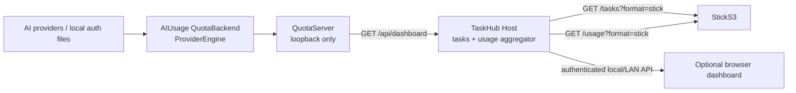
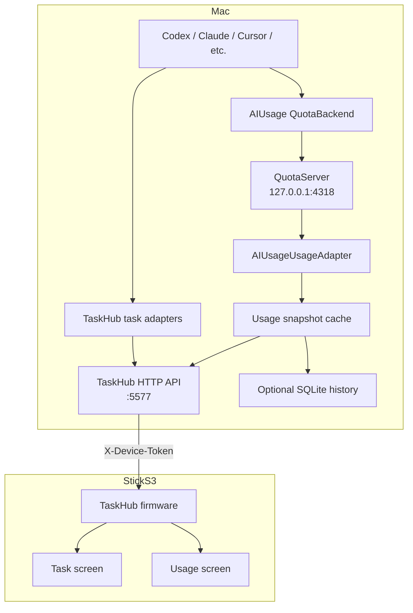
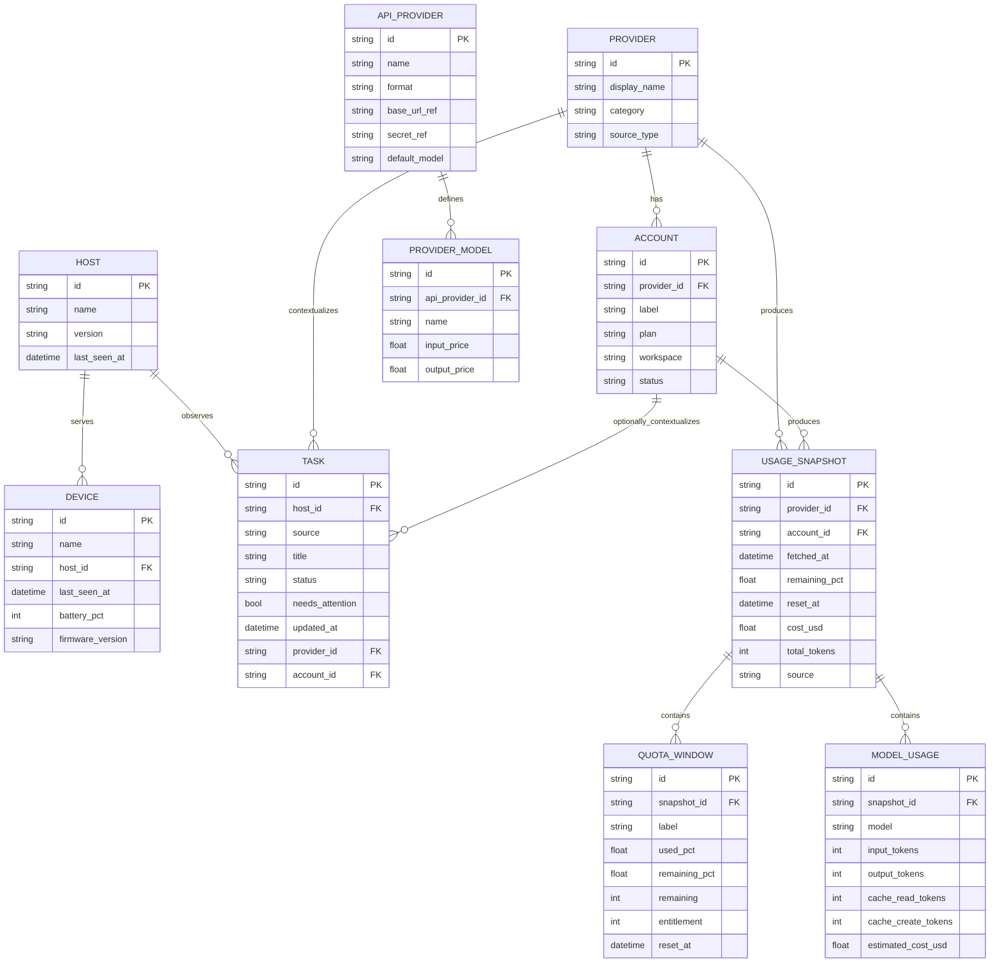

# Deep Research Report: Integrating AIUsage with TaskHub for StickS3

## Executive summary

The two repositories are highly complementary but operate at different layers.

**[AIUsage](https://github.com/sylearn/AIUsage)** is a macOS-native Swift/SwiftUI application and reusable Swift backend for **AI subscription/quota monitoring, account management, provider normalization, usage/cost accounting, and local AI-proxy management**. Its core `QuotaBackend` package already solves the difficult provider-specific problems: authentication discovery, token refresh, multi-account reconciliation, provider-specific API calls, normalized quota windows, token/cost ledgers, and proxy attribution. The current repository registers 13 backend provider adapters and exposes normalized data through `ProviderEngine` and an HTTP-capable `QuotaServer`. citeturn5view0turn5view2 fileciteturn21file0

**[TaskHub for StickS3](https://github.com/sheepxux/Taskhub-for-StickS3)** is a local-first, battery-conscious **AI task-state monitor**. A Python Mac Host scans local state from Codex, Claude Code, Cursor and several desktop/browser agents, exposes a compact HTTP API, discovers peer Macs over UDP, and drives an ESP32-S3/M5StickS3 firmware UI. The device deliberately does almost no provider logic itself: it wakes, discovers a host, fetches `/tasks?format=stick`, renders a compact state, handles buttons/voice actions, and sleeps. citeturn4view0 fileciteturn36file0

The strongest architecture is therefore **not to port AIUsage into the ESP32 firmware and not to duplicate its provider implementations in Python**. Instead:

> **Use AIUsage's `QuotaBackend`/`QuotaServer` as a loopback-only usage service, add an AIUsage adapter plus usage cache to the TaskHub Mac Host, and make TaskHub the single authenticated LAN gateway to StickS3.**

This preserves the existing separation of responsibilities:



This arrangement is particularly important because AIUsage provider operations are not bounded to the latency that the StickS3 expects. `ProviderEngine` has provider timeouts ranging from approximately 15 seconds to 300 seconds, whereas TaskHub firmware currently gives HTTP requests an 8-second timeout. A synchronous “refresh AIUsage every time StickS3 wakes” design would therefore create avoidable device failures. The correct model is **background refresh → cached normalized snapshot → millisecond-class StickS3 response**. fileciteturn39file0 fileciteturn36file0

A second important architectural finding is security-related. AIUsage's HTTP server exposes `/api/dashboard`, `/api/providers`, and `/api/provider/:id`; the routing shown in `QuotaHTTPServer.swift` does not impose authentication on those dashboard routes and its common CORS policy allows `*`. The app-side `APIService` defaults to `127.0.0.1:4318`, which is an appropriate boundary. Consequently, **the AIUsage service should remain loopback-only; TaskHub's authenticated host should be the only component exposed to the LAN**. fileciteturn25file0 fileciteturn33file0 fileciteturn34file0

The resulting product would have three distinct surfaces:

| Surface | Primary job | Recommended UX |
|---|---|---|
| Mac dashboard | Rich management | Tasks + quotas + costs + accounts + provider health |
| StickS3 | At-a-glance awareness | Task status first; optional quota/usage page second |
| M5Burner | Installation/provisioning | Firmware discovery/download/burn only |

That last distinction matters: **M5Burner is a distribution/flashing experience, not a runtime dashboard**. Official M5Stack documentation shows a workflow of choosing the StickS3/device family, downloading firmware, selecting a serial port, starting the burn, and entering configuration such as Wi-Fi; TaskHub correctly uses M5Burner to distribute a secret-free firmware image and performs runtime configuration afterward through USB/NVS. citeturn2search2turn2search14turn2search3 fileciteturn35file0

As of August 25, 2026, the latest published AIUsage release retrieved from GitHub is **v0.15.11, published August 22, 2026**, while TaskHub's latest GitHub release is **v2.2.0, published July 19, 2026**. TaskHub v2.2.0 ships an unsigned macOS Host package and a public merged M5Burner firmware image; AIUsage v0.15.11 ships macOS DMG and ZIP artifacts. fileciteturn41file0 fileciteturn42file0

My implementation recommendation is a staged project:

**Phase A:** headless AIUsage usage bridge + TaskHub `/usage` API, no firmware changes.  
**Phase B:** combined Mac web dashboard and cached usage history.  
**Phase C:** a second StickS3 “Usage” screen with provider quota cards.  
**Phase D:** optional provider/account management from the Mac dashboard, deliberately not from the StickS3.  
**Phase E:** signed/notarized host packaging and M5Burner public release.

The core integration is **medium complexity** if AIUsage remains a sidecar and **high complexity** if the project tries to absorb AIUsage's provider/auth code directly.

## Repository analysis

**AIUsage**

AIUsage describes itself as one dashboard for managing AI subscriptions, quotas, costs, accounts and coding proxies. Its current feature surface includes 12+ user-facing providers, multi-account operation, Claude/Codex/OpenCode usage statistics, native Claude/Codex/OpenCode proxy tracks, a managed CLIProxyAPI gateway (“CPA Gateway”), a global proxy mode, unified API-provider definitions, call analytics and a menu-bar surface. Credentials managed by AIUsage are stored through macOS Keychain-backed infrastructure. citeturn5view0turn5view2turn5view3

Its architecture is significantly more reusable than the SwiftUI application alone suggests. The repository explicitly separates:

| Layer | Responsibility | Important source |
|---|---|---|
| SwiftUI application | Navigation, accounts, provider UI, proxy UI, settings | [`AIUsage/`](https://github.com/sylearn/AIUsage/tree/main/AIUsage) |
| `ProviderRefreshCoordinator` | Refresh orchestration and UI data pipeline | [`ProviderRefreshCoordinator.swift`](https://github.com/sylearn/AIUsage/blob/main/AIUsage/ViewModels/ProviderRefreshCoordinator.swift) |
| `ProviderEngine` | Concurrent provider fetching and credential-backed account fetches | [`ProviderEngine.swift`](https://github.com/sylearn/AIUsage/blob/main/QuotaBackend/Sources/QuotaBackend/Engine/ProviderEngine.swift) |
| `ProviderRegistry` | Central provider registration | [`ProviderRegistry.swift`](https://github.com/sylearn/AIUsage/blob/main/QuotaBackend/Sources/QuotaBackend/Engine/ProviderRegistry.swift) |
| Provider adapters | Provider-specific auth/API/file handling | [`Providers/`](https://github.com/sylearn/AIUsage/tree/main/QuotaBackend/Sources/QuotaBackend/Providers) |
| Normalizer | Raw provider usage → canonical dashboard model | [`Normalizer/`](https://github.com/sylearn/AIUsage/tree/main/QuotaBackend/Sources/QuotaBackend/Normalizer) |
| `QuotaServer` | HTTP API + Claude/Codex/OpenCode proxy runtime | [`QuotaServer/`](https://github.com/sylearn/AIUsage/tree/main/QuotaBackend/Sources/QuotaServer) |
| Account store | Credential persistence and retrieval | [`AccountCredentialStore.swift`](https://github.com/sylearn/AIUsage/blob/main/QuotaBackend/Sources/QuotaBackend/Engine/AccountCredentialStore.swift) |
| API-provider model | Reusable upstream/model/pricing definitions | [`APIProvider.swift`](https://github.com/sylearn/AIUsage/blob/main/AIUsage/Models/APIProvider.swift) |
| Usage archives | Proxy cost/token history | [`USAGE_AND_BILLING.md`](https://github.com/sylearn/AIUsage/blob/main/docs/USAGE_AND_BILLING.md) |

The repository's architecture document describes the app as two main modules: the SwiftUI application and `QuotaBackend`; it further documents provider refresh as `UI → ProviderRefreshCoordinator → ProviderEngine → Provider → UsageNormalizer → normalized dashboard`. fileciteturn11file0

The most important abstraction for TaskHub integration is already clean:

```swift
public protocol ProviderFetcher: Sendable {
    var id: String { get }
    var displayName: String { get }
    var description: String { get }
    func fetchUsage() async throws -> ProviderUsage
}

public protocol CredentialAcceptingProvider: ProviderFetcher {
    var supportedAuthMethods: [AuthMethod] { get }
    func fetchUsage(with credential: AccountCredential) async throws -> ProviderUsage
}
```

AIUsage's credential model supports `cookie`, `token`, `authFile`, `apiKey`, `oauth`, `webSession`, and `auto` authentication modes. Its raw `ProviderUsage` supports account identity plus primary/secondary/tertiary quota windows and provider-specific `extra` values. fileciteturn12file0

After normalization, `ProviderSummary` is almost exactly what a dashboard integration needs: provider/account IDs, status, source information, remaining percentage, reset time, metrics, quota windows, cost summaries, model breakdowns and optional raw usage. `DashboardSnapshot` combines these with a high-level overview and alert collection. fileciteturn23file0

The currently registered backend adapters are:

`Antigravity`, `Claude`, `CodexCost`, `Codex`, `Copilot`, `Cursor`, `Droid`, `Gemini`, `Kimi`, `Kiro`, `MiniMax`, `OpenCodeCost`, and `Warp`. fileciteturn21file0

That distinction between **quota providers** and **local-cost providers** is worth retaining in TaskHub rather than reducing everything to one percentage. For example, Claude's current provider implementation explicitly reads AIUsage's persistent Claude gateway usage archive and produces today/week/month/all-time token and cost data rather than a subscription quota window. fileciteturn29file0

AIUsage's server already exposes the fundamental integration API:

| Endpoint | Semantics |
|---|---|
| `GET /health` / `/api/health` | Runtime health |
| `GET /api/providers` | Registered provider metadata |
| `GET /api/dashboard` | Full normalized dashboard snapshot |
| `GET /api/dashboard?ids=codex,cursor,...` | Selected providers |
| `GET /api/provider/:id` | Single provider |
| `/v1/messages` | Claude proxy surface |
| `/v1/responses` | Codex/OpenAI Responses surface |
| `/v1/chat/completions` | OpenCode proxy surface |
| `/__aiusage/admin/*` | Protected proxy hot-switch administration |

These routes are visible directly in `QuotaHTTPServer.swift`. fileciteturn33file0 fileciteturn34file0

The app's own `APIService` already consumes `/api/dashboard` and defaults to `http://127.0.0.1:4318`. That makes its client semantics an especially useful contract for a TaskHub adapter. fileciteturn25file0

AIUsage is overwhelmingly a **Swift/macOS project**, with SwiftUI application code, a SwiftPM backend, Network.framework-based HTTP service, Xcode project files and shell packaging/regression scripts. `QuotaBackend/Package.swift` targets macOS 14 and Swift tools 5.9 and has no external Swift-package dependency in the package definition itself. fileciteturn17file0

For end users the README specifies **macOS 14+**, a Universal Binary for Intel and Apple Silicon, and DMG/ZIP installation. The release workflow builds with the newer Swift 6.2/Xcode 26 toolchain on `macos-26`, runs `swift test` plus proxy/CPA regression scripts, packages DMG/ZIP outputs, signs components where configured, and publishes tagged releases. citeturn5view0 fileciteturn26file0

Its license is **Apache License 2.0**. This is permissive and includes an explicit patent grant, but copied or modified AIUsage code must retain the applicable Apache licensing notices and satisfy Apache-2.0 redistribution conditions rather than simply being silently relicensed as MIT. fileciteturn30file0

The repository is architecturally mature but not free of integration-relevant defects. An open August 2026 issue reports that some Codex bulk/global refresh paths could retain stale multi-account quota values while a direct per-account refresh returned correct data. The issue itself identifies differing refresh chains and credential-backed versus automatic-scan merging as the likely area. That is a warning against depending on UI-level refresh state; TaskHub should consume the normalized backend contract and independently timestamp/cache every snapshot. fileciteturn24file0


Source image: [`docs/images/dashboard-overview_en.png`](https://github.com/sylearn/AIUsage/blob/main/docs/images/dashboard-overview_en.png). AIUsage's README presents the dashboard alongside account monitoring, CPA Gateway, proxy, usage-statistics, menu-bar and call-analytics screens. citeturn5view0

**TaskHub for StickS3**

TaskHub deliberately takes the opposite approach: the ESP32 device is kept simple while the Mac does discovery, filesystem/process inspection, state normalization and actions. The README's architecture connects Codex, Claude Code, Cursor, OpenClaw, Manus, Perplexity, Gemini, Lovable, Kimi, WorkBuddy and Grok into a Mac Host, then uses UDP discovery and HTTP to serve the StickS3. citeturn4view0

Its main components are:

| Layer | Implementation | Role |
|---|---|---|
| Host service | Python | Adapter scans, cache, peer discovery, HTTP API, app-opening actions |
| Host configuration | Python | Environment/defaults and provider heuristics |
| Voice module | Python + whisper.cpp | Local speech-to-text and app input |
| Browser bridge | Chrome/Edge extension | Push browser-only task titles/state via `/ingest` |
| Firmware | Arduino C++ | Wi-Fi, discovery, HTTP, M5Unified UI, buttons, audio, IMU, deep sleep |
| Installer/package | shell/macOS package | LaunchAgent installation and host deployment |
| M5Burner build | shell + Arduino CLI | Secret-free public firmware artifact |

The central host is currently concentrated in [`host/task_hub.py`](https://github.com/sheepxux/Taskhub-for-StickS3/blob/main/host/task_hub.py), while environment and heuristic constants have been separated into [`host/taskhub_config.py`](https://github.com/sheepxux/Taskhub-for-StickS3/blob/main/host/taskhub_config.py). The host relies almost entirely on Python's standard library: filesystem globbing, plist/JSON parsing, SQLite, subprocesses, threading, `urllib`, `http.server` and concurrent futures are visible in the main source. fileciteturn20file0

Its canonical task shape is effectively:

```json
{
  "id": "...",
  "source": "Codex",
  "title": "...",
  "status": "running",
  "updated_at": "...",
  "updated_ms": 0,
  "age_sec": 0,
  "subtitle": "...",
  "detail": {},
  "usage": {},
  "needs_attention": false,
  "_open": {}
}
```

Statuses are normalized to `waiting`, `running`, `failed`, `done`, `idle`, `recent`, or `unknown`, and the host explicitly ranks attention/waiting tasks ahead of ordinary running/recent tasks. fileciteturn20file0

That is different from AIUsage's data model: **TaskHub describes units of work; AIUsage describes accounts/provider consumption**. Trying to represent every quota account as a fake “task” would be semantically poor. The two models should be related but remain distinct.

TaskHub's host API currently includes `/health`, `/tasks`, compact StickS3 task output, local-only task output for peer aggregation, task detail/open actions, voice, diagnostics, peers and `/debug/lovable`; `/ingest` also accepts externally pushed tasks with a TTL. citeturn4view0 fileciteturn10file0

The host already supports a lightweight integration mechanism through `/ingest`; an external item requires `source` and `title`, with optional status, subtitle, URL, timestamps, TTL, `needs_attention`, detail and usage. This makes `/ingest` suitable for an **initial proof of concept**, but not the final AIUsage integration because quota snapshots are persistent structured metrics rather than transient tasks. fileciteturn10file0

The firmware uses M5Unified, Wi-Fi, UDP, `HTTPClient`, ArduinoJson, ESP32 `Preferences`/NVS and ESP sleep APIs. It stores up to ten in-memory tasks and a smaller RTC snapshot; its documented execution path is `wake → cached preview → Wi-Fi → GET /tasks?format=stick → display → sleep`. fileciteturn36file0

The device's native screens are already unusually well documented: the repository has pixel-accurate 240×135 renderings for boot, wake, run, wait, fail, done, empty and hub-unreachable states. citeturn4view0


Source image: [`docs/screen-run.png`](https://github.com/sheepxux/Taskhub-for-StickS3/blob/main/docs/screen-run.png). Other directly useful render references include [`screen-wait.png`](https://github.com/sheepxux/Taskhub-for-StickS3/blob/main/docs/screen-wait.png), [`screen-done.png`](https://github.com/sheepxux/Taskhub-for-StickS3/blob/main/docs/screen-done.png), and [`docs/render_screens.py`](https://github.com/sheepxux/Taskhub-for-StickS3/blob/main/docs/render_screens.py). citeturn4view0

The current firmware supports deep sleep, task alerts, speaker feedback, automatic rotation and portrait multi-task display. The v2.2.0 README's Eco defaults include a 10-minute ordinary wake interval, 120-second active/attention wake interval, 1.5-second timer-wake display period, and 80 MHz power-save CPU clock. citeturn4view0

Build/run dependencies are straightforward: macOS host, Python 3, Arduino CLI, ESP32 Arduino core, M5Unified and ArduinoJson; Node.js is optional for local LevelDB-based application sources, and whisper.cpp is optional for voice. Host setup is automated by `./scripts/setup.sh`; the firmware can be compiled/uploaded through the same script or the firmware helper. citeturn4view0

TaskHub's CI is notably portable: host tests run on Ubuntu with Python 3.11 and use stdlib `unittest`; firmware CI installs ESP32 Arduino core `3.3.8`, M5Unified and ArduinoJson and compiles both normal and public builds; a separate macOS job builds and inspects the unsigned Host package. fileciteturn27file0

TaskHub uses the **MIT License**. fileciteturn31file0

## Integration architecture

The central design principle should be:

> **AIUsage owns provider/account/usage truth. TaskHub owns task truth, LAN authentication, StickS3 delivery and low-latency caching.**

AIUsage already has a canonical normalized provider model, while TaskHub already has a canonical task model. The integration should therefore introduce a third, small **dashboard aggregation layer**, not collapse either model into the other. fileciteturn12file0 fileciteturn23file0 fileciteturn20file0

A recommended runtime is:



**Why use an HTTP sidecar instead of importing Swift into Python?**

`QuotaBackend` is a Swift module targeting macOS, whereas TaskHub Host is Python. Direct linkage would require either a custom C ABI/FFI layer or embedding another runtime boundary. AIUsage already contains an executable `QuotaServer` and its own launcher logic for locating/building, launching and health-checking that helper, making a process/HTTP boundary the most natural reusable interface. fileciteturn17file0 fileciteturn48file0

However, TaskHub should **not assume that opening the AIUsage GUI means a permanent quota HTTP service is listening at 4318**. AIUsage uses QuotaServer in multiple proxy/runtime roles, and its launcher is explicitly parameterized by arguments, environment, health URL and port. A robust TaskHub integration should either launch a dedicated quota-only helper or detect an existing compatible instance and fall back to its own helper. fileciteturn48file0

A practical process model is:

1. `taskhub-host` starts.
2. `AIUsageUsageAdapter` probes configured `http://127.0.0.1:4318/health`.
3. It checks an integration/API version, not only `"ok": true`.
4. If unavailable and the TaskHub distribution bundles the helper, it launches `QuotaServer` on a dedicated loopback port such as `4319`.
5. Provider refresh runs independently of HTTP device requests.
6. A successful `/api/dashboard` is transformed into a TaskHub-owned `UsageSnapshot`.
7. The previous successful snapshot remains available if the next AIUsage refresh fails.
8. StickS3 requests never wait for provider authentication or external network requests.

The dedicated background cache solves a concrete timing mismatch. AIUsage's provider engine gives some sources much longer budgets—including 45 seconds for Droid, 60 seconds for OpenCode and up to 300 seconds for Codex-cost scanning—while TaskHub firmware uses an 8-second HTTP timeout. fileciteturn39file0 fileciteturn36file0

A suitable host API extension would be:

| Endpoint | Purpose | Device needs it? |
|---|---|---:|
| `GET /usage` | Full normalized provider/account view | No |
| `GET /usage?format=stick` | Compact provider cards | Yes |
| `GET /usage/:providerId` | Provider detail | No |
| `GET /usage/history?...` | Time-series cost/token/quota data | No |
| `POST /usage/refresh` | Trigger asynchronous refresh | Optional |
| `GET /dashboard` | Combined tasks + usage browser UI | No |
| `GET /dashboard.json` | Combined machine API | Optional |
| `GET /integration/aiusage/health` | Bridge diagnostics | No |

Existing `/tasks` should stay backward-compatible. The firmware can independently request `/usage?format=stick`, or a future protocol can return one envelope:

```json
{
  "protocol": 2,
  "generated_ms": 1787600000000,
  "tasks": [],
  "usage": {
    "attention": 1,
    "monthly_usd": 31.42,
    "providers": []
  }
}
```

I prefer the independent `/usage` route for the first production version because it keeps old firmware compatible and prevents a provider-side schema expansion from bloating every task fetch.

**Authentication should terminate at TaskHub.** AIUsage's dashboard routes currently have no route-level authentication in `QuotaHTTPServer`; the HTTP server also declares `Access-Control-Allow-Origin: *`. Conversely, AIUsage's app client defaults to loopback. The safest integration is thus:

```text
StickS3 ── X-Device-Token ──> TaskHub :5577
                               |
                               | loopback, no LAN exposure
                               v
                      QuotaServer :4318/4319
```

fileciteturn13file0 fileciteturn25file0 fileciteturn34file0

The bridge should never forward secrets from `ProviderUsage.raw`, `AccountCredential`, API-provider definitions or proxy configuration to the StickS3. AIUsage's `AccountCredential` contains an actual credential string, and the unified `APIProvider` model contains an `apiKey`; those fields belong entirely on the Mac. fileciteturn12file0 fileciteturn22file0

A proposed **compact provider card** is:

```json
{
  "id": "codex:cred:...",
  "provider": "codex",
  "label": "Codex",
  "account": "Work",
  "status": "ok",
  "remaining_pct": 72.5,
  "reset_sec": 16800,
  "metric": "72% · 4h40m",
  "attention": false
}
```

For a cost source rather than quota source:

```json
{
  "id": "claude",
  "provider": "claude",
  "label": "Claude",
  "kind": "cost",
  "status": "ok",
  "metric": "$2.18 today",
  "secondary": "$31.42 month",
  "tokens": 135490
}
```

This distinction maps cleanly to AIUsage's canonical `ProviderSummary.category`, `windows`, `remainingPercent`, `costSummary`, `models` and `metrics`. fileciteturn23file0

An important optional integration is **task-to-provider correlation**. TaskHub already knows that a row originates from Codex, Claude Code, Cursor, Gemini, Kimi, etc.; AIUsage knows the corresponding quota/cost provider. A dashboard can therefore display:

```text
Codex
  Task: Refactor payment pipeline        RUN
  Account: work@example.com              Pro
  5h quota: ███████░░░                   72%
  Weekly:   █████░░░░░                   51%
  Current task tokens:                   18,294
```

The linkage should be explicit, using a mapping table such as `task_source → provider_id`, and never based merely on display-name string comparison.

The initial mapping is naturally:

| TaskHub source | AIUsage source | Correlation quality |
|---|---|---|
| Codex | `codex`, `codex-cost` | Excellent |
| Claude Code | `claude` cost ledger | Good for cost; subscription quota is not represented by current Claude provider |
| Cursor | `cursor` | Good |
| Gemini | `gemini` | Good |
| Kimi | `kimi` | Good |
| Others such as WorkBuddy/Grok/Lovable | No registered equivalent today | None |
| Copilot | `copilot` | Usage-only unless a TaskHub task adapter is added |
| Kiro | `kiro` | Usage-only unless TaskHub adds task tracking |
| Antigravity | `antigravity` | Usage-only |
| Droid | `droid` | Usage-only |
| MiniMax | `minimax` | Usage-only |
| OpenCode | `opencode` local-cost source | Potentially good if TaskHub adds native OpenCode task tracking |
| Warp | `warp` | Usage-only |

The source lists come from TaskHub's adapter matrix and AIUsage's provider registry. citeturn4view0 fileciteturn21file0

## UI/UX comparison

The three relevant products solve fundamentally different user journeys.

| Dimension | AIUsage | TaskHub | M5Burner |
|---|---|---|---|
| Main device | Mac | StickS3 + Mac Host | Mac/Windows/Linux |
| Core job | Provider/account/usage management | At-a-glance AI task status | Flash/install firmware |
| Information density | High | Extremely low | Medium |
| Primary navigation | Sidebar + dashboard/detail pages | Buttons + tiny status cards | Device/firmware catalog + flashing dialogs |
| Long-form settings | Yes | Host/browser config | Firmware burn/provision fields |
| Secrets | Keychain/local config | Mac token + Wi-Fi/NVS | Should not bake project secrets into public firmware |
| Runtime monitoring | Extensive | Yes, task-centric | No |
| Cost analytics | Yes | Limited per-task usage | No |
| Task actions | No equivalent task workflow | Open app, switch, dictate | No |
| Distribution | DMG/ZIP | Git/source/pkg + firmware | Firmware catalog/burn workflow |

AIUsage's current navigation includes Dashboard, Subscriptions, CPA Gateway, API Providers, Codex Proxy, OpenCode Proxy, Claude Code Proxy, Usage Stats, Call Analytics, Inbox and Settings. It is therefore a full desktop management application rather than an embedded-device UI model. fileciteturn11file0

TaskHub's design is intentionally status-driven. Its state model prioritizes `WAIT`, `FAIL`, `RUN`, recent and finished rows and applies time-based hiding to stale device rows without deleting host-side state. It also uses edge-triggered WAIT and DONE alerts to wake or audibly notify the user. citeturn4view0

M5Burner should stay outside the runtime information architecture. M5Stack's official StickS3 documentation describes opening M5Burner, selecting the relevant StickS3 class, downloading a firmware, connecting the hardware, selecting its serial port, starting the flash and providing Wi-Fi/device configuration where required. Its separate publishing workflow supports metadata such as firmware name, version, description, device type, GitHub reference, firmware binary and cover image. citeturn2search2turn2search3turn2search14

TaskHub already makes the correct product decision for M5Burner: [`build_m5burner_public.sh`](https://github.com/sheepxux/Taskhub-for-StickS3/blob/main/firmware/build_m5burner_public.sh) compiles with `TASKHUB_PUBLIC_BUILD=1` and explicitly ignores local `secrets.h`; the user provisions Wi-Fi/token afterward. fileciteturn35file0

For an AIUsage-enabled TaskHub, I recommend these **StickS3 screens**, in this order:

| Screen | Content | Input |
|---|---|---|
| Task | Existing RUN/WAIT/DONE task experience | BtnA next; BtnB open |
| Usage overview | Worst/most relevant quota plus today/month cost | BtnA next provider |
| Provider detail | Provider/account + 1–3 quota windows | BtnA account |
| System | Mac host, bridge health, battery/network | Diagnostic only |

The default screen must remain **Task**, because active/waiting work is the time-sensitive signal and is TaskHub's established purpose. Quota state changes much more slowly and should be a secondary page.

A compact usage layout can reuse the visual language already present in TaskHub:

```text
┌────────────────────────────────────┐
│ CODEX                         72%  │
│ Work Pro                           │
│ ███████████████░░░░░              │
│ 5h quota · resets 04:42            │
│ Week 51%                    2/4    │
└────────────────────────────────────┘
```

For cost:

```text
┌────────────────────────────────────┐
│ CLAUDE                        COST │
│ Today          $2.18               │
│ Month         $31.42               │
│ Tokens       135.5k                │
│ Gateway archive               1/3  │
└────────────────────────────────────┘
```

A provider with failed credentials should use an attention screen rather than leaking diagnostic details:

```text
┌────────────────────────────────────┐
│ GEMINI                        !    │
│ Account needs reconnect            │
│ Last data: 36m ago                 │
│ Open TaskHub on Mac                │
└────────────────────────────────────┘
```

AIUsage's normalized errors include machine-readable codes such as `not_logged_in`, `missing_token` and `invalid_credentials`; the StickS3 should map these to a few safe user-facing states and leave exact remediation to the Mac dashboard. fileciteturn23file0

The proposed **Mac dashboard** should combine the two existing information architectures rather than cloning the AIUsage SwiftUI UI:

```text
Dashboard
├── Attention
│   ├── Claude waiting for input
│   └── Gemini credentials need reconnect
├── Active Tasks
├── Provider Quotas
├── Cost Today / Week / Month
└── Devices / Peers

Tasks
Usage
Providers
History
Devices
Diagnostics
Settings
```

The endpoints required by those workflows would be:

| Screen/workflow | Required host endpoints |
|---|---|
| Dashboard | `/dashboard.json`, `/tasks`, `/usage` |
| Task detail | existing `/tasks/:id` |
| Open task | existing `/tasks/:id/open` |
| Usage cards | `/usage` |
| StickS3 usage | `/usage?format=stick` |
| Provider details | `/usage/:providerId` |
| Historical graphs | `/usage/history` |
| Manual refresh | `POST /usage/refresh` |
| Bridge state | `/integration/aiusage/health` |
| Device/peer status | existing `/diagnostics.json`, `/peers.json` |
| Account configuration | preferably deep-link AIUsage initially; native TaskHub management only in a later phase |

Account configuration is the area where **reuse is preferable to reimplementation**. AIUsage already handles provider-specific credential formats, browser/device OAuth flows, token refreshes, imported auth files and Keychain persistence. For example, Codex supports token/auth-file/automatic authentication and refreshes OAuth credentials, Gemini imports its CLI OAuth auth file, Cursor can use cookies/browser sessions, Copilot supports a GitHub token or automatic `gh` discovery, and Kimi can use an API key or automatic local configuration. fileciteturn28file0 fileciteturn38file0 fileciteturn46file0 fileciteturn37file0 fileciteturn44file0

Moving all those workflows into TaskHub would substantially expand its security and maintenance surface for little benefit.

## Provider capability and data model

AIUsage actually exposes two related provider concepts:

**Subscription/usage providers** obtain account quota or local cost data through `ProviderFetcher`. **API Providers** are user-defined upstream configurations containing base URL, API key, protocol, models and prices that can be distributed to Codex/Claude/OpenCode/CPA proxy targets. These should not be conflated in the TaskHub schema. fileciteturn12file0 fileciteturn22file0

A useful provider capability matrix is:

| AIUsage provider | Primary capability | Authentication/config visible in reviewed source | Multi-account | Useful on StickS3 |
|---|---|---|---:|---|
| Antigravity | Per-model quota | `authFile`, OAuth; Google Cloud Code Assist | Yes-capable | Quota % / reset |
| Claude | Gateway token/cost ledger | Local AIUsage usage archive; no provider credential needed for ledger | N/A | Today/month cost |
| Codex | Subscription quota windows | token, auth file, auto; OAuth refresh | Yes | Quota/reset |
| Codex Cost | Local token/cost history | Local proxy/session data | N/A | Today/month cost |
| GitHub Copilot | Premium/chat/completion quotas | token or auto via local GitHub auth | No | Quota/reset |
| Cursor | Cursor usage quota | cookie, web session, auto browser-cookie discovery | No | Quota |
| Droid | Quota | Provider-specific auth/API implementation | Registered | Quota |
| Gemini CLI | Cloud Code Assist quota | auth file or automatic `~/.gemini/oauth_creds.json` | Credential-capable | Quota/reset |
| Kimi Code | Weekly + rate-limit windows | API key or automatic local config; regional endpoint metadata | No | 5h/week |
| Kiro | App quota | auth-file/auto with token refresh | Yes | Quota |
| MiniMax Token Plan | 5h + weekly subscription windows | subscription API key; region | No | 5h/week |
| OpenCode Cost | Local session/model cost | Local OpenCode ledger | N/A | Today/month cost |
| Warp | Usage/quota | Provider-specific implementation | Registered | Quota if normalized |

The registry establishes the provider set; the authentication details above are directly visible for Antigravity, Codex, Copilot, Cursor, Gemini, Kimi, Kiro and MiniMax, while Claude's implementation documents its archive-only accounting model. fileciteturn21file0 fileciteturn43file0 fileciteturn28file0 fileciteturn37file0 fileciteturn46file0 fileciteturn38file0 fileciteturn44file0 fileciteturn47file0 fileciteturn45file0 fileciteturn29file0

AIUsage's reusable **API-provider configuration** is more regular:

| Field | Meaning | Send to StickS3? |
|---|---|---:|
| `id` | Stable provider definition ID | Optional |
| `name` | User-visible provider name | Yes |
| `baseURL` | Upstream endpoint | **No** by default |
| `apiKey` | Upstream credential | **Never** |
| `format` | OpenAI Chat / Anthropic / OpenAI Responses | Optional |
| `models[]` | Models and pricing metadata | Only sanitized model names |
| `defaultModel` | Default model | Yes if useful |
| `contextLimit` | Context capacity | Optional |
| `outputLimit` | Output capacity | Optional |
| `temperature` | Generation default | No device need |
| `topP` | Generation default | No device need |
| `maxOutputTokens` | Generation limit | Optional |
| `frequencyPenalty` | Generation parameter | No |
| `presencePenalty` | Generation parameter | No |
| `createdAt` / `lastUsedAt` | Metadata | Usually no |
| `sortOrder` | UI ordering | Could reuse |

AIUsage currently recognizes three API formats: **OpenAI Chat Completions, Anthropic Messages, and OpenAI Responses**. Codex accepts only Responses for its upstream; Claude and OpenCode can consume all three through their respective mapping/conversion paths; CPA's current API-upstream mapping accepts OpenAI-compatible formats. fileciteturn22file0

That model gives a clean future direction: a TaskHub provider settings page could display sanitized API-provider metadata while delegating credential editing to AIUsage.

For persistent integration data, I recommend this logical schema:



The distinction between snapshots and quota windows mirrors AIUsage's `ProviderUsage`/`ProviderSummary` structures, while Task remains consistent with TaskHub's existing task object. fileciteturn12file0 fileciteturn23file0 fileciteturn20file0

For a lightweight implementation, SQLite is sufficient on the Mac and avoids adding a service dependency. TaskHub already uses Python's `sqlite3` module for source inspection, so introducing an application-owned SQLite database does not require another runtime. fileciteturn20file0

Recommended retention:

```text
latest snapshot       always
raw 1-minute samples  24 hours
15-minute rollups     30 days
daily rollups         indefinitely or user-configurable
```

The history database should never store provider credentials. It should contain only normalized metric snapshots.

A provider adapter interface on the TaskHub side can stay deliberately small:

```python
from dataclasses import dataclass, field
from datetime import datetime
from typing import Protocol, Any


@dataclass(frozen=True)
class UsageRecord:
    provider_id: str
    account_id: str | None
    label: str
    status: str
    fetched_at: datetime
    remaining_pct: float | None = None
    reset_at: datetime | None = None
    cost_today_usd: float | None = None
    cost_month_usd: float | None = None
    total_tokens: int | None = None
    windows: tuple[dict[str, Any], ...] = field(default_factory=tuple)


class UsageProviderAdapter(Protocol):
    @property
    def id(self) -> str:
        ...

    def health(self) -> dict[str, Any]:
        ...

    def fetch(self) -> list[UsageRecord]:
        """Fetch from a local integration service, never from StickS3."""
        ...
```

The AIUsage implementation becomes an HTTP translation layer rather than another provider implementation:

```python
class AIUsageAdapter:
    id = "aiusage"

    def __init__(self, base_url: str = "http://127.0.0.1:4319"):
        self.base_url = base_url.rstrip("/")

    def fetch(self) -> list[UsageRecord]:
        payload = get_json(
            f"{self.base_url}/api/dashboard",
            timeout=5.0,  # bridge timeout, not provider refresh timeout
        )

        records: list[UsageRecord] = []

        for result in payload.get("providers", []):
            summary = result.get("summary") or {}
            if not summary:
                continue

            cost = summary.get("costSummary") or {}

            records.append(
                UsageRecord(
                    provider_id=result.get("providerId", result.get("id", "")),
                    account_id=result.get("accountId"),
                    label=summary.get("label") or summary.get("name") or "AI",
                    status=summary.get("status", "unknown"),
                    fetched_at=parse_datetime(
                        summary.get("fetchedAt") or payload["generatedAt"]
                    ),
                    remaining_pct=summary.get("remainingPercent"),
                    reset_at=parse_optional_datetime(summary.get("nextResetAt")),
                    cost_today_usd=period_usd(cost.get("today")),
                    cost_month_usd=period_usd(cost.get("month")),
                    total_tokens=period_tokens(cost.get("overall")),
                    windows=tuple(summary.get("windows") or []),
                )
            )

        return records
```

AIUsage's actual response fields represented here are defined by `ProviderSummary` and `DashboardSnapshot`. fileciteturn23file0

Task scheduling should be decoupled from the device request:

```python
class UsageScheduler:
    def __init__(self, adapter, store, refresh_sec: int = 60):
        self.adapter = adapter
        self.store = store
        self.refresh_sec = refresh_sec
        self.next_refresh = 0.0
        self.refreshing = False

    def tick(self, now: float) -> None:
        if self.refreshing or now < self.next_refresh:
            return

        self.refreshing = True
        try:
            rows = self.adapter.fetch()
            self.store.commit_snapshot(rows)
            self.next_refresh = now + self.refresh_sec
        except Exception as exc:
            # Keep last-known-good snapshot.
            self.store.record_refresh_error(str(exc))
            self.next_refresh = now + min(self.refresh_sec, 30)
        finally:
            self.refreshing = False
```

Production code should perform the fetch on TaskHub's worker pool/background thread rather than blocking `ThreadingHTTPServer`.

For billing aggregation, preserve AIUsage's separated token categories instead of keeping only `total_tokens`. Its normalized model-cost structure contains input, output, cache-read and cache-create tokens plus estimated USD cost. fileciteturn23file0

```python
@dataclass
class BillingMetric:
    provider: str
    model: str
    input_tokens: int = 0
    output_tokens: int = 0
    cache_read_tokens: int = 0
    cache_create_tokens: int = 0
    estimated_cost_usd: float = 0.0

    @property
    def total_tokens(self) -> int:
        return (
            self.input_tokens
            + self.output_tokens
            + self.cache_read_tokens
            + self.cache_create_tokens
        )
```

Critically, TaskHub should consume AIUsage's already-calculated costs rather than recalculating historical prices. AIUsage's Claude archive, for example, is designed to preserve per-request historical cost rather than retroactively repricing old traffic. fileciteturn29file0

## Implementation plan

The following effort ratings are engineering estimates for a developer already comfortable with Python, Swift/macOS and Arduino/ESP32. They are not repository claims.

| Work item | Effort | Approx. focused effort | Result |
|---|---:|---:|---|
| Define integration JSON contract | Low | 1–2 days | Versioned normalized usage protocol |
| Build Python `AIUsageAdapter` | Medium | 2–4 days | `/api/dashboard` ingestion |
| Add background cache/scheduler | Medium | 2–3 days | Device-safe latency |
| Add `/usage` API | Low | 1–2 days | Full + compact representations |
| Add AIUsage health diagnostics | Low | 1 day | Bridge status in diagnostics |
| Add SQLite snapshot/history store | Medium | 2–4 days | Historical graphs/rollups |
| Build combined Mac dashboard | Medium | 4–7 days | Tasks + quota + cost UI |
| Task/provider correlation | Medium | 2–4 days | Contextual quota on task rows |
| Add StickS3 usage mode | Medium | 3–5 days | Provider/account card screens |
| Add compact JSON parser/model | Low | 1–2 days | Firmware usage payload |
| Add quota alerts | Medium | 2–4 days | Threshold/reset warnings |
| Package QuotaServer helper | High | 4–8 days | Self-contained deployment |
| Signing/notarization | Medium | 2–4 days | Gatekeeper-friendly host |
| M5Burner release automation | Medium | 2–3 days | Reproducible public firmware |
| Contract/unit tests | Medium | 3–5 days | Stable compatibility |
| End-to-end Mac→Stick tests | High | 4–7 days | Integrated confidence |
| Credential-management UI in TaskHub | High | 10+ days | Only pursue if AIUsage dependency must disappear |

The first usable integration is therefore roughly a **medium-sized 1–2 week engineering increment** without firmware UI, while a polished distributable including firmware mode, history, packaging and E2E tests is more plausibly several focused engineering weeks. Those are planning estimates rather than commitments.

The first milestone should have one acceptance criterion:

> With AIUsage/QuotaServer unavailable, TaskHub behaves exactly as before. With it available, `GET /usage` returns a cached normalized snapshot without increasing `/tasks?format=stick` latency.

That backwards-compatibility goal fits TaskHub's current simple device protocol and avoids putting the core task-monitor experience at risk. citeturn4view0

The second milestone should introduce host-side UI/history only. This allows all quota semantics—multi-window limits, cost versus quota sources, account labels, reconnect conditions—to stabilize before firmware constraints are involved.

The third milestone should implement the StickS3 usage UI. Because the hardware's screen is only 240×135 and the firmware is already optimized around limited interactive time, the device payload should contain preformatted/simplified metrics rather than full AIUsage JSON. TaskHub's repository itself treats 240×135 as the canonical rendering size. citeturn4view0

The fourth milestone can add alerts. Suggested rules are:

```text
remaining <= 20%        attention
remaining <= 10%        critical
reset <= 15 min         reset-soon
credential invalid      attention
bridge stale > 2x TTL   degraded
cost/day threshold      configurable attention
```

AIUsage already computes overview concepts including active, attention, critical and reset-soon provider counts, so TaskHub can either consume those or apply its own device-specific threshold policy. fileciteturn23file0

The fifth milestone is distribution.

**Recommended libraries/tools**

| Area | Recommendation |
|---|---|
| Python HTTP integration | Keep `urllib.request` initially; optionally `httpx` only if dependency policy changes |
| Schema validation | `dataclasses` + explicit parsers initially; Pydantic only if dependencies are acceptable |
| Persistence | stdlib `sqlite3` |
| Mac service | Existing LaunchAgent approach |
| Swift provider runtime | AIUsage `QuotaBackend` + `QuotaServer` |
| Firmware | Existing M5Unified + ArduinoJson |
| Firmware settings | Existing ESP32 `Preferences` NVS |
| UI screenshot tests | Extend existing `docs/render_screens.py` |
| Voice | Existing whisper.cpp integration |
| Packaging | Existing macOS `pkgbuild` flow plus signing/notarization |
| Firmware distribution | Existing Arduino CLI + M5Burner public build |
| CI | GitHub Actions |

TaskHub's current dependency-light approach is a strength. Its CI explicitly requires no Python packages for core host tests, so retaining a stdlib bridge avoids introducing package-management failures into a hardware utility. fileciteturn27file0

**Recommended repository structure**

```text
Taskhub-for-StickS3/
├── host/
│   ├── task_hub.py
│   ├── taskhub_config.py
│   │
│   ├── core/
│   │   ├── models.py
│   │   ├── scheduler.py
│   │   └── cache.py
│   │
│   ├── adapters/
│   │   ├── tasks/
│   │   │   ├── codex.py
│   │   │   ├── claude.py
│   │   │   ├── cursor.py
│   │   │   └── ...
│   │   └── usage/
│   │       ├── base.py
│   │       └── aiusage.py
│   │
│   ├── api/
│   │   ├── tasks.py
│   │   ├── usage.py
│   │   ├── diagnostics.py
│   │   └── dashboard.py
│   │
│   ├── storage/
│   │   ├── usage_store.py
│   │   └── migrations/
│   │
│   ├── web/
│   │   ├── index.html
│   │   ├── app.js
│   │   └── dashboard.css
│   │
│   └── tests/
│       ├── fixtures/
│       │   └── aiusage/
│       ├── test_aiusage_adapter.py
│       ├── test_usage_api.py
│       └── test_usage_store.py
│
├── integration/
│   └── aiusage/
│       ├── README.md
│       ├── protocol-v1.schema.json
│       └── helper/
│
├── firmware/
│   └── task_monitor/
│       ├── task_monitor.ino
│       ├── task_model.h
│       ├── usage_model.h
│       ├── task_screen.cpp
│       └── usage_screen.cpp
│
├── docs/
│   ├── integration-aiusage.md
│   ├── screen-usage-overview.png
│   └── render_screens.py
└── .github/workflows/
    ├── ci.yml
    └── release.yml
```

A refactor of `task_hub.py` into adapters/core/API modules is advisable during this work rather than continuing to add provider logic to the monolithic host file. The current file already owns task models, process/filesystem helpers, many provider-specific heuristics, caching, HTTP behavior and diagnostics. fileciteturn20file0

**CI/CD**

The strongest approach is to combine practices already present in the two projects.

TaskHub currently performs Python tests/byte-compilation, two firmware compiles and macOS package construction. AIUsage's release workflow adds Swift unit tests, several proxy regression suites, code-signing checks, artifact verification and release packaging. fileciteturn27file0 fileciteturn26file0

An integrated CI pipeline should add:

```text
Host
  python unittest
  py_compile
  API contract fixture tests
  SQLite migration tests
  stale-cache/failure tests

AIUsage bridge
  swift test
  launch QuotaServer on loopback
  GET /health
  GET /api/dashboard
  validate protocol fixture

Firmware
  compile normal build
  compile TASKHUB_PUBLIC_BUILD
  render screenshots
  parse compact usage fixture
  enforce flash-size budget

Security
  ensure no secrets.h in artifacts
  scan packaged payload for tokens/auth files
  verify loopback AIUsage binding
  inspect macOS package contents

Release
  build signed/notarized Host
  build merged public firmware
  produce hashes
  attach both to tagged release
```

TaskHub v2.2.0 already reports that its public firmware has no Wi-Fi/device token and that its release pipeline checks package/firmware artifacts for private credentials; this is exactly the policy that should be preserved once AIUsage is added. fileciteturn42file0

Deployment has three reasonable options:

| Deployment | Assessment |
|---|---|
| **Existing AIUsage installation + TaskHub adapter** | Lowest effort; best development path |
| **TaskHub Host bundle includes licensed QuotaServer helper** | Best polished user experience; more signing/licensing work |
| **Reimplement AIUsage providers in Python** | Not recommended; highest ongoing maintenance/security cost |

The first should be used to validate the architecture. The second is the preferred eventual consumer package.

The ESP32 should never receive the AIUsage helper or provider-specific code. TaskHub's existing “thin device, smart Mac Host” model is exactly right for an ESP32-S3 and preserves power, flash and operational simplicity. fileciteturn36file0

M5Burner remains a deployment channel. M5Stack's own StickS3 documentation supports this model, and TaskHub already produces a secret-free public artifact specifically for it. citeturn2search2turn2search14 fileciteturn35file0

## Risks, gaps, and recommendations

The largest **technical risk** is provider refresh semantics. Provider APIs and local auth formats change independently, which is precisely why AIUsage contains substantial provider-specific code. TaskHub should resist the temptation to copy small pieces of that code: doing so would create two separate implementations of OAuth refresh, browser cookies, local auth-file discovery and quota parsing. AIUsage's Codex, Gemini, Cursor and other adapters illustrate how much provider-specific recovery logic exists beneath what appears to be a simple quota request. fileciteturn28file0 fileciteturn38file0 fileciteturn46file0

The second risk is **latency and failure coupling**. AIUsage fetches external quota APIs and scans potentially large local histories; some backend timeout budgets are dramatically longer than the StickS3's HTTP window. Provider refresh must therefore be asynchronous and stale-while-revalidate. fileciteturn39file0 fileciteturn36file0

The third is **security boundary erosion**. AIUsage handles credentials, OAuth state, auth files, cookies, API keys and proxy management secrets. TaskHub currently uses a comparatively simple shared device token. No AIUsage credential object or API-provider key should be serialized through TaskHub's LAN API, peer protocol, browser UI responses or firmware cache. fileciteturn12file0 fileciteturn22file0

Relatedly, the AIUsage dashboard HTTP routes visible in the current server code should be treated as **local-only trusted IPC**, not as an authenticated network API. Keeping QuotaServer on loopback and re-exporting sanitized data through TaskHub is therefore not merely architectural neatness; it is a security requirement. fileciteturn13file0 fileciteturn34file0

TaskHub's own LAN model also deserves care. Its host/peer architecture shares one token among hosts and devices and uses LAN HTTP/UDP discovery. That is appropriate for a local appliance but should not be mistaken for an Internet-facing security model. citeturn4view0

The fourth risk is **semantic mismatch**. A Codex task's token count, a Codex subscription quota window and Codex proxy billing are related but are not interchangeable metrics. The combined UI should explicitly label:

```text
Task usage       tokens/turns for this task
Quota            provider subscription allowance
Local cost       AIUsage-calculated proxy/session cost
```

AIUsage itself distinguishes quota sources and local-cost sources in `ProviderSummary.category`, which provides a sound basis for that separation. fileciteturn23file0

The fifth risk is **account identity**. AIUsage has substantial logic devoted to avoiding duplicate accounts and workspaces; Codex in particular can have multiple workspace identities associated with similar display metadata. TaskHub should persist AIUsage's stable provider/account IDs rather than treating email or account label as a key. fileciteturn39file0

The sixth risk is **stale-data presentation**. AIUsage currently has an open report specifically concerning stale Codex quota after certain bulk refresh paths. The integration must display `fetched_at`/age and retain a distinction among fresh, stale and unavailable data rather than showing an old percentage as though it were current. fileciteturn24file0

A compact freshness model should be:

```text
fresh      age <= 2 × configured refresh interval
stale      prior successful data exists but refresh failed/aged out
offline    no successful snapshot exists
auth       provider specifically reports reconnect/auth failure
```

The seventh risk is **host maintainability**. TaskHub's present source works and is extensively tested, but `task_hub.py` already centralizes many adapters, task modeling, caches, platform helpers, diagnostics and HTTP behavior. AIUsage integration is a good boundary at which to modularize rather than adding another large subsystem to that file. fileciteturn20file0

The eighth is **macOS distribution**. TaskHub's current Host package is explicitly preview/unsigned; AIUsage's release infrastructure, by contrast, contains a significantly more developed signing and packaged-helper verification pipeline. A consumer-quality combined installer will need Developer ID signing, notarization, helper-signature verification and careful entitlement/Keychain behavior. citeturn4view0 fileciteturn26file0 fileciteturn42file0

The ninth is **licensing**. TaskHub is MIT while AIUsage is Apache-2.0. Process-level interoperability over HTTP is especially clean from a provenance perspective. If AIUsage source is copied into TaskHub or a modified `QuotaBackend`/`QuotaServer` is distributed inside the TaskHub package, the resulting distribution must retain the relevant Apache-2.0 terms/notices for that component. fileciteturn30file0 fileciteturn31file0

The final gaps/open questions that materially affect implementation are:

| Open question | Recommended default |
|---|---|
| Must AIUsage GUI be installed? | **No** long-term; bundle a headless helper after PoC |
| Should StickS3 directly call AIUsage? | **No** |
| Should quotas be encoded as tasks? | **No**, except temporary PoC via `/ingest` |
| Should credentials be configured from StickS3? | **No** |
| Should TaskHub own provider credentials? | **No** initially |
| Should quota refresh happen on every device wake? | **No** |
| Should TaskHub store cost history? | Yes, normalized non-secret snapshots |
| Should peer Macs exchange usage? | Optional later; begin local-host only |
| Should usage affect deep-sleep cadence? | Only critical/auth attention, not ordinary quota changes |
| Should TaskHub duplicate AIUsage price calculations? | **No** |
| Should API-provider keys be visible over LAN? | **Never** |
| Is a web dashboard required? | Recommended, but can follow the API PoC |
| Is M5Burner part of runtime architecture? | **No; distribution only** |

The best first pull request would therefore be intentionally small: introduce `host/adapters/usage/aiusage.py`, a cached `UsageSnapshot`, `/usage` and `/integration/aiusage/health`, fixture-based contract tests, and documentation. It should make **zero firmware changes** and require **zero credential duplication**.

The second pull request should extract TaskHub's host APIs/adapters into modules and add SQLite history plus the Mac dashboard.

Only after those contracts are stable should the third pull request alter [`firmware/task_monitor/task_monitor.ino`](https://github.com/sheepxux/Taskhub-for-StickS3/blob/main/firmware/task_monitor/task_monitor.ino) to add the compact usage screen.

That order leverages what each repository already does best: AIUsage remains the provider/auth/billing engine; TaskHub remains the local task aggregator and authenticated hardware gateway; and M5Burner remains the clean, secret-free installation channel. citeturn5view0turn4view0turn2search14